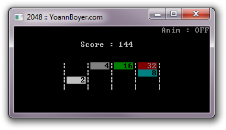

# 2048.c

> Console version of the 2048 game in C language

### Gameplay
- Like in the initial game, use your arrow keys to move the tiles. When two tiles with the same number touch, they merge into one.
- You can also change animation of the moving cells by pressing the `a` key during the game.

### Requirements
- GNU GCC Compiler
